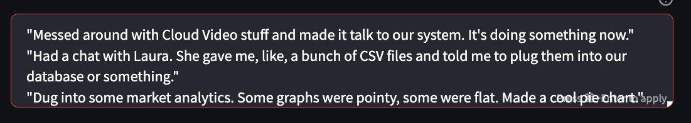
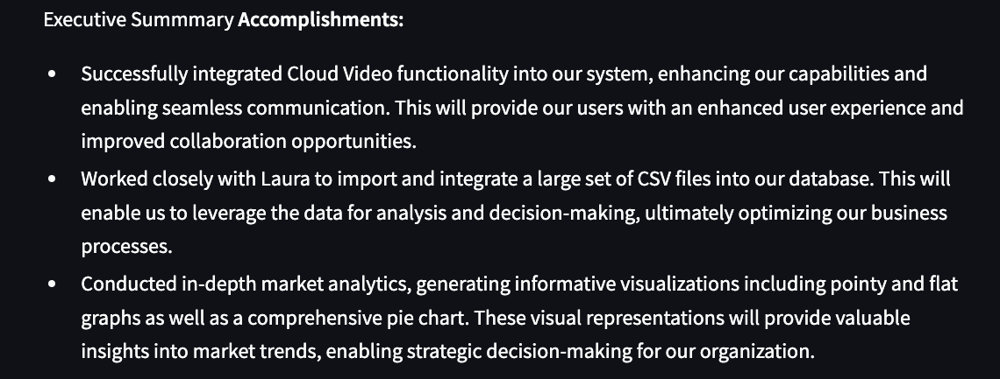
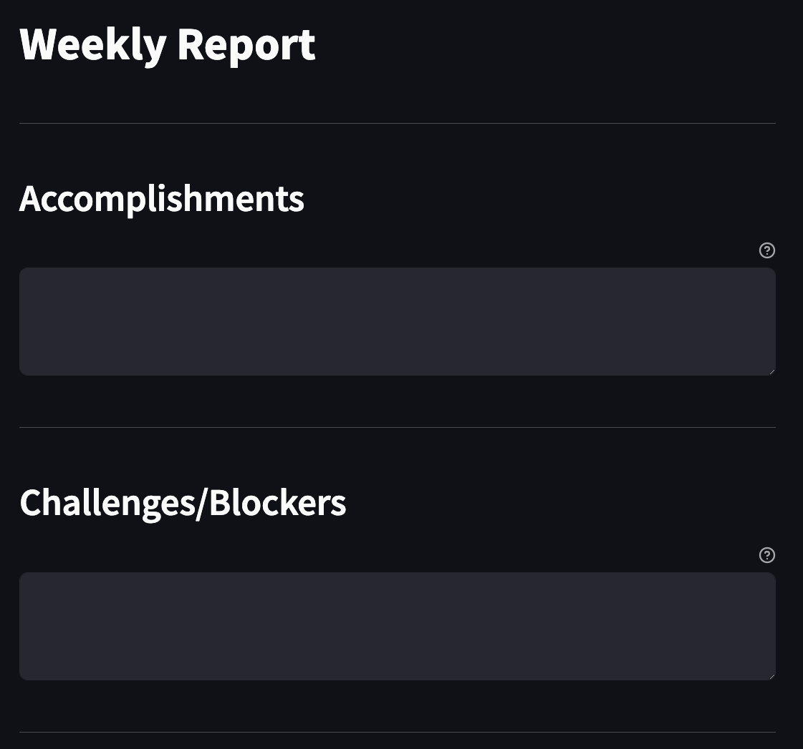

# GPT Based - Weekly Report Generator

## 🚀 Try the Application Live!
[**Launch the AISL Weekly Report Generator**](https://aisl-weekly-updates.streamlit.app/)

This tool is designed to create succinct weekly reports from rough notes. By summarizing accomplishments, challenges, and next steps, the app aids in presenting clear and concise information for both peers and managers.


## Examples:

👎🏽 **Turns Unprofessional Notes**



👍🏽 **Into Professional Executive Summaries**




## Features:

- **User-friendly Interface**: Simply input your weekly accomplishments, challenges, and planned next steps.




  
- **GPT-3.5-Turbo Powered Summaries**: Utilizes one of OpenAI's advanced models, `gpt-3.5-turbo`, to generate executive summaries based on your input.

- **Formatted Presentation**: Your summaries are presented in a clear, professional manner with the ability to emphasize key points using bold and highlighting, prioritizing the business benefits of technical solutions.


## Usage:

1. **Start the App**: Ensure you have all the dependencies installed and run the Streamlit app locally after cloing this repo or [use this link to try the app on the web](https://aisl-weekly-updates.streamlit.app/).

2. **Input Details**:
    - **Accomplishments**: Describe what you achieved over the week.
    - **Challenges/Blockers**: Specify any obstacles or hindrances you faced.
    - **Next Steps**: Outline your plans for the upcoming week.

3. **Generate Summary**: Once all details are inputted, click the "Summarize" button to get your executive summary.


## Setup Locally with Docker:
1. Clone this repository to your local machine
2. Go into repo and create your OPENAI secrets 

    ```bash
    mkdir .streamlit

3. Create a .toml file with your OPENAI keys
    ```bash
    touch secrets.toml

4. Add your OpenAI API Keys to this file (triple check that your .gitignore moves this file from any commits you do to to protect your information):
    ```bash
    [openai]
    org = xxxxxxxxxxxxxxxxx
    key = xxxxxxxxxxxxxxxxx

5. Build the Docker image from the repository:

    ```bash
    docker build -t streamlit-weekly-todo . 

6. Run the docker image
    ```bash
    docker run -d -p 8502:8502 streamlit-weekly-todo


Then you will be able to open up your container through Docker Desktip and click on the link to the port to access the application.


## Dependencies:

- Streamlit: For the web interface.
- OpenAI Python client: For integrating with the GPT-3.5-Turbo model.

## Setup Locally with PIP:

1. Ensure you have Python installed on your system.
2. Clone this repository.
3. Install the required packages using pip:

   ```bash
   pip3 install -r requirements.txt

4. Run the application locally:

    ```bash
    streamlit run app.py
