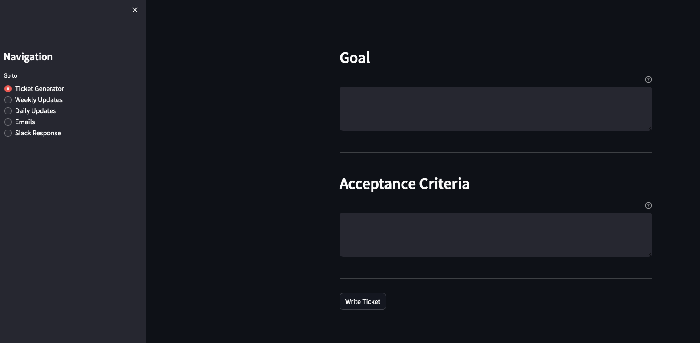

# hpm
hpm is an AI-powered tool designed to assist with common office writing tasks.



# Key Features

## Jira Ticket Generator

This Streamlit application assists in creating tickets for Jira/Rally ticketing systems. The key features include:

1. **Goal Input**: Users can input the specific issue or feature that needs to be addressed in the ticket.
2. **Acceptance Criteria Input**: Users can define the expected outcome or desired functionality after the ticket resolution.
3. **Ticket Generation**: The application generates a ticket summary using a GPT model upon clicking the 'Write Ticket' button.
4. **GPT Model Integration**: The application integrates with a GPT model to generate the ticket summary.
5. **User-friendly Interface**: The application uses Streamlit's simple and intuitive interface for easy ticket creation.
6. **Formatting Guide**: The application provides a formatting guide to help users create well-structured and clear tickets.

## Weekly Report

This Streamlit application generates a weekly report for AISL. The main features include:

1. **Role Input**: Users can input their role, with "Principal Cloud Architect" set as the default.
2. **Accomplishments Section**: Users can enter their accomplishments for the week.
3. **Challenges/Blockers Section**: Users can describe any challenges or blockers they faced during the week.
4. **Next Steps Section**: Users can outline their planned next steps.
5. **Summary Generation**: The application generates a summary of the user's input using a GPT model upon clicking the "Summarize" button.

## Daily Stand-Up

This Streamlit application assists users in providing an update for a daily stand-up in the agile/scrum methodology. The main features include:

1. **Text Input Areas**: Users can enter their daily accomplishments, plans for tomorrow, and any challenges or blockers they are facing.
2. **Summarize Button**: Users can generate a summary of their input using a GPT model by clicking the 'Summarize' button.
3. **GPT Model Integration**: The application integrates with a GPT model to generate a summary of the user's input.
4. **Dynamic Content Rendering**: The application dynamically renders content based on user interaction.
5. **User-Friendly Interface**: The application uses headers and separators to clearly distinguish between different sections.

## Email Writer

This Streamlit application assists in writing professional emails. The main features include:

1. **Role Input**: Users can input their role.
2. **Recipient Input**: Users can input the recipient's name.
3. **Email Body Input**: Users can input the content of the email.
4. **Email Generation**: The application generates a professional email based on the user's input and the predefined prompt structure upon clicking the 'Write Email' button.
5. **User Configuration**: The application uses a user configuration file to retrieve the user's details for use in the email generation.
6. **GPT Model**: The application uses a GPT model to generate the email content.

## Slack Writer

This Streamlit application generates conversational responses to Slack messages. The key features include:

1. **Title Rendering**: The application displays a title "Chat Response" and the user's job title.
2. **Slack Message Input**: Users can input recent Slack messages that they want to respond to.
3. **Response Generation Button**: Users can trigger the response generation process by clicking the "Respond" button.
4. **Response Generation**: The application uses a GPT model to generate a conversational response to the input Slack messages.
5. **User Configuration**: The application uses a UserConfig class from a config module to get user-specific information.

# Software Installation

Ensure you have the secrets.toml in the .streamlit directory.

```bash
ls .streamlit 
```

Should return the following: 

```bash
secrets.toml
```

This file should contain the following keys to be able to access API keys.

```bash
[openai]
key = "{MY OPENAI KEY HERE}"
org = "{MY OPENAI ORG HERE}"
```

Create a virtual environment and activate it.

```bash
python -m venv .venv
source .venv/bin/activate
```

Set up dependencies with Makefile

```bash
make setup
```

Run application with Makefile

```bash
make run
```

or

```bash
streamlit run hpm.py
```